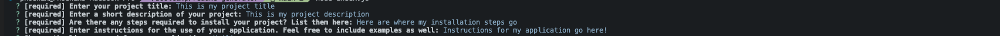

# Professional README Generator

## Description
This application uses nodejs to create a professional README markdown file.

## Table of Contents
* [Installation](#installation)
* [Usage](#usage)
* [Credits](#credits)
* [License](#license)
* [Questions](#questions)

## Installation
This application requires nodeJS ([download and read the documentation here](https://nodejs.org/en/download/)).

## Usage
Clone the repository and in the terminal, type the below command: 
`node index.js`
 
Questions and prompts about your application will appear in the terminal. Answer these right in the command line:  

 
Once you've answered all the questions, a README.md file will be created in the 'dist' folder.
 

[Click here for a demonstration video of this application!](https://drive.google.com/file/d/1YR7_9b0_SGNrJyKLDqiYvL22bN8g0CMt/view?usp=sharing)

## Credits
Starter code was provided from the repo [here](https://github.com/coding-boot-camp/potential-enigma). 
Special thanks as well to lukas-h for the markdown license badges from his repo [here](https://gist.github.com/lukas-h/2a5d00690736b4c3a7ba).

## License
  
This application is covered under the MIT license. To learn more, visit the link [here!](https://opensource.org/licenses/MIT)

## Questions
Questions? My Github is [here](https://github.com/phoenixouyang)
